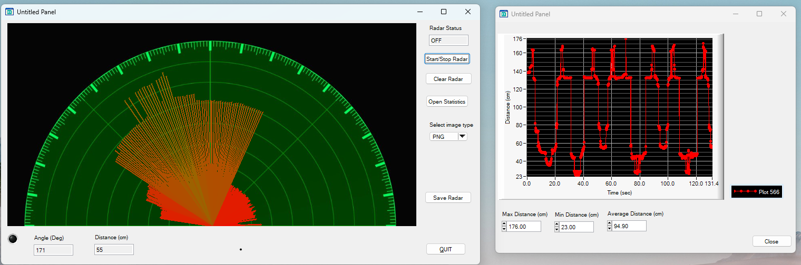

# Radar Scanning System using CVI and Arduino

🚀 This project simulates a radar scanning system using an **Arduino UNO**, **Ultrasonic Distance Sensor**, **Servo Motor**, and **NI LabWindows/CVI** for real-time visualization and statistics.

## 📸 Preview
  
---

## 🔧 Hardware Used
- Arduino UNO
- HC-SR04 Ultrasonic Distance Sensor
- Servo Motor (e.g., SG90)
- USB connection to PC (Serial communication)

---

## 🖥️ Software Components
- CVI (LabWindows) application
- Arduino sketch
- DLL for parallel stats calculation (avg, min, max)
- Radar visual on canvas
- Real-time stats panel and threaded graph updates

---

## 🧠 Key Features
- Real-time radar sweep from 0° to 180°
- Distance measurement using ultrasonic sensor
- Data visualization on radar and
